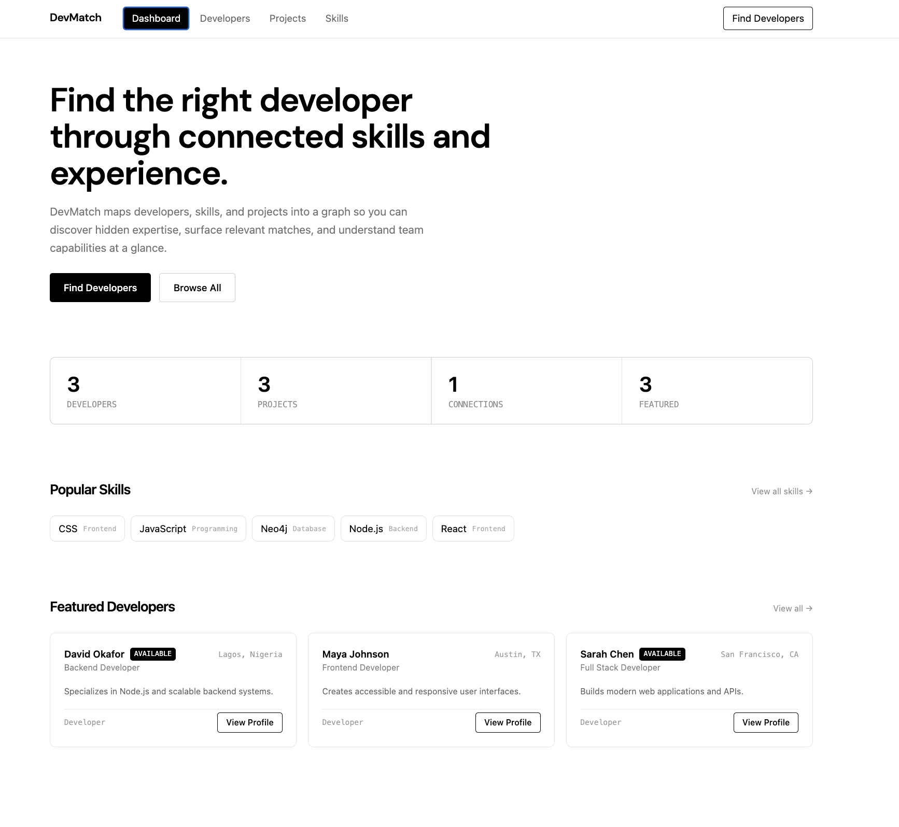
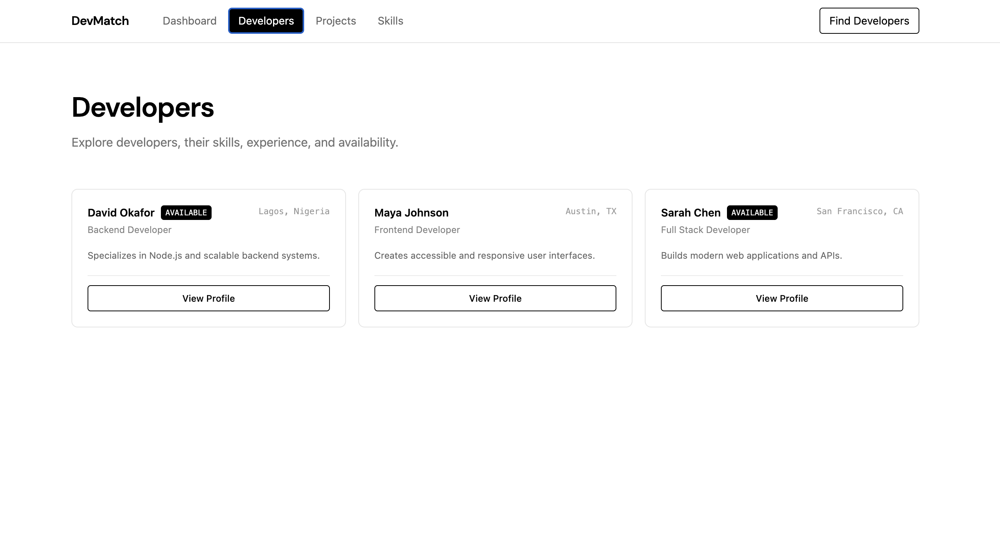
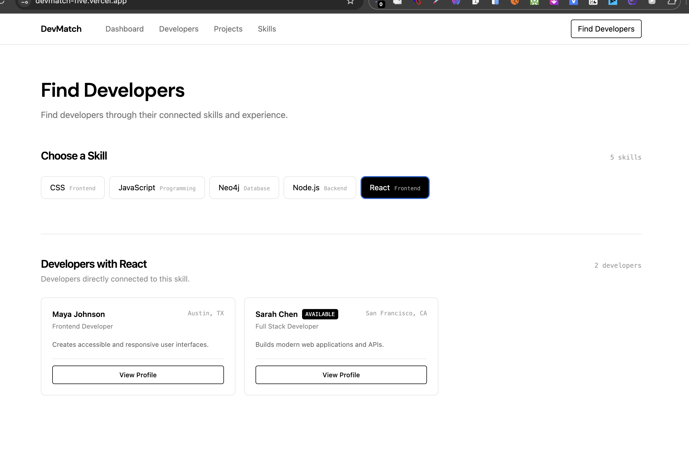

# DevMatch

DevMatch is a graph-based developer discovery platform built with React, Node.js, Express, and CognoDB.

It connects developers, skills, and projects to help users discover relevant developers through their skills and project experience.

## Features

- Browse developers
- View developer profiles
- Browse projects and skills
- Find developers by skill
- Discover connected developers through projects and shared skills
- View project details and relationships

## Tech Stack

- React + Vite
- Node.js + Express
- CognoDB
- Cypher
- Axios
- Tailwind CSS

## Why a Graph Database?

DevMatch focuses on relationships between developers, skills, and projects.

A graph database makes these relationships easy to model and query. It allows DevMatch to answer relationship-based questions such as finding developers connected through a project and a shared skill without relying on complex table joins.

## Graph Model

Developer -- HAS_SKILL --> Skill

Developer -- WORKED_ON --> Project

Project -- USES_SKILL --> Skill

This model allows developers to be discovered through connected skills and project experience.

## Main Graph Query

The main graph-based query finds developers connected through a project and shared skill:

    MATCH (developer1:Developer)-[:WORKED_ON]->(project:Project)
          -[:USES_SKILL]->(skill:Skill)
          <-[:HAS_SKILL]-(developer2:Developer)
    WHERE developer1.name < developer2.name
    RETURN DISTINCT developer1, developer2, project, skill
    ORDER BY developer1.name

This query demonstrates a multi-hop graph traversal between developers, projects, and skills.

## API Endpoints

Developers:
- GET /api/developers
- GET /api/developers/by-skill?skill=React
- GET /api/developers/by-project-skill?skill=React
- GET /api/developers/connections
- GET /api/developers/profile/:name

Projects:
- GET /api/projects
- GET /api/projects/by-name?name=DevMatch

Skills:
- GET /api/skills

Health:
- GET /api/health

## Database Setup

Create a CognoDB database and add the following environment variables to backend/.env:

    COGNODB_URI=your_cognodb_uri
    COGNODB_USERNAME=your_cognodb_username
    COGNODB_PASSWORD=your_cognodb_password

The .env file is excluded from Git.

## Database Seeding

From the backend directory:

    node src/scripts/seed.js

The seed script creates developers, skills, projects, and their relationships.

## Running Locally

Backend:

    cd backend
    npm install
    npm run dev

Frontend:

    cd frontend
    npm install
    npm run dev

## Project Structure

    devmatch/
    ├── backend/
    │   ├── src/
    │   │   ├── config/
    │   │   ├── controllers/
    │   │   ├── queries/
    │   │   ├── routes/
    │   │   └── scripts/
    │   ├── index.js
    │   └── package.json
    │
    ├── frontend/
    │   ├── src/
    │   │   ├── components/
    │   │   ├── pages/
    │   │   └── services/
    │   └── package.json
    │
    ├── screenshots/
    │   ├── dashboard.png
    │   ├── developer-profile.png
    │   └── find-developers.png
    │
    └── README.md

## Screenshots

### Dashboard

### Developer Profile

### Find Developers

## Live Demo

https://devmatch-five.vercel.app

## Backend API

https://devmatch-api-zneb.onrender.com

## Author

Ugonna Aninwodo

Built as a graph-based developer discovery application demonstrating CognoDB, Cypher queries, REST APIs, graph relationships, and a React frontend.